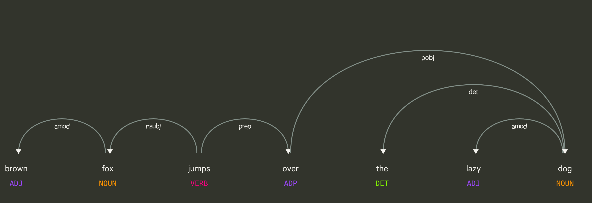
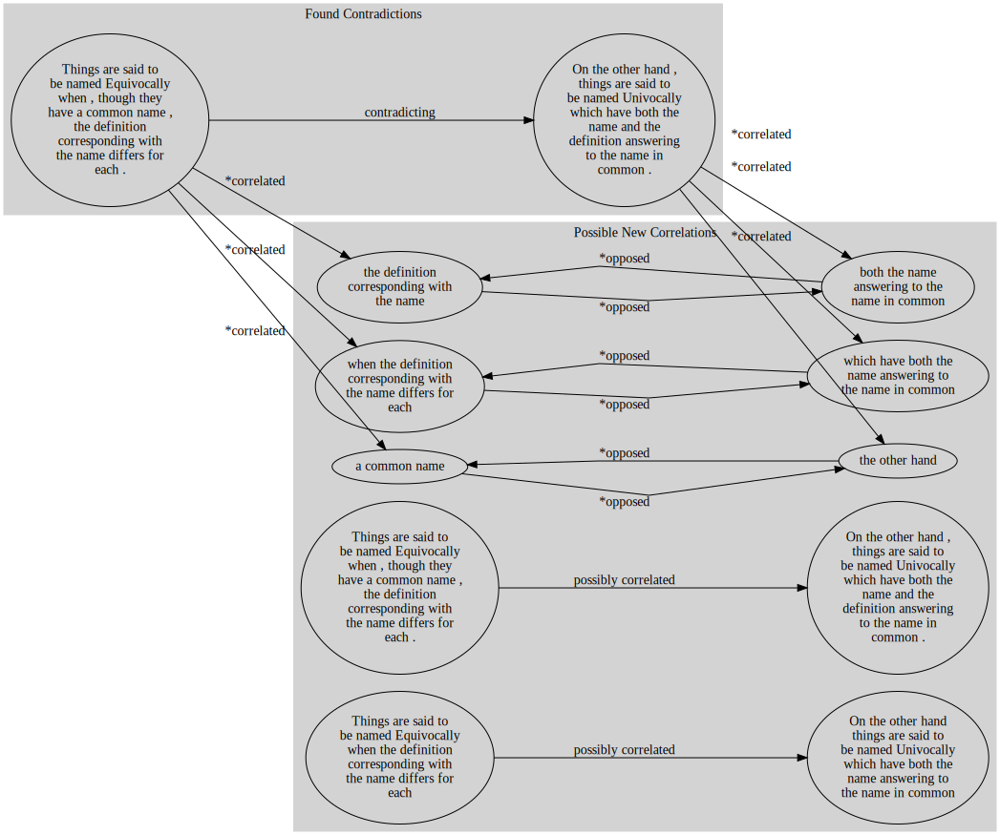
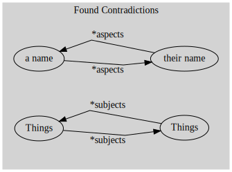

# S0krates

S0krates is a tool, that mines distinctions. Distinctions are the decisive points in theoretical text, that are a phänomenon in language that either helps to shape theories or to contrast results from the state of the art. Another field are law texts, what to do and what not to do. Or its a part of aethetics, to know, what are the features, you like and which you not like (See [Pierre Bourdieu - Distinction](https://en.wikipedia.org/wiki/Distinction_(book)) Its a cognitive technique, that shapes  

So if you write a scientific essay, you are advised to define your concepts and make fundamental distinctions, that are at work in your theory.

Another time distinctions appear at the point, when you present the results of these essays. You have to contrast them with the results of before and of other scientists. You say something like: "Before it was so and so. In contrast, afert my results it ist something else, namely so and so."

So, with ``distinction`` here I mean if a writer proposes two kinds or perspectives of something and gives a little explanation, in what they differ. 

Let's take for the sake of explanation these two sentences of Aristotle:

>  Forms of speech are either simple or composite. 
>   Examples of the latter are such expressions as 'the man runs', 'the man wins'; of the former 'man', 'ox', 'runs', 'wins'.

But by distinction I don't mean here, if somebody treats `money` and `luck` as something different, and doesn't draw a connection between these two things.

In short, how the following works. You are going to think think tl;dr? Just glance through and pick cherries. There are many pictures.
 
  1. [Extract predicative structures and their arguments, resolving elliptic expressions](#predicative-chunks)

  2. [Search for pairs of predicates, that have a strong contrast, either by anonyms or by negations.](#finding-contrasts)
  3. [Search for another pair of expressions that is related to this constrasting pair](#find-correlative-pairs-to-the-contrasting-pairs)
  4. [Find the subjects under the arguments of the predicats, that is talked about, and some word, what is the distinctive criterium.](#finding-themes-and-aspects)
  5. [If there are contrast, the correlation and a common subject and distinctive criterium together, retrieve that as a ``distinction``.](#matching-results-in-neo4j)
  
Here we go

## predicative chunks

First the text is cut into chunks by rules based on grammar annotations (they are taken from spacy, that annotates the dependence structure of hte sentence). These chunks are also annotated with embeddings (they are embeddings taken and vectors of importance per vector (the tf-idf-value for every word in the sentence). 

The idea of predicates is since early days of western philosophy of Plato and Aristotle, had a decisive discussion about `methexis`, how the things of the real world relate the concepts, that humans have of them, and how this is rendered in natural language. This partitioning of language structure into subject (ὑποκείμενον, subjectum) and predicate (κατηγορόυμενον, predicatum) we have until now in formal logic, when we write `Fa`, when the predicate `F` is said of the individual `a`.

In a sentence there apperear normally multiple such predications. If you look at this sentence (similar to Chomskies famous sentence):

    The brown fox jumps over the lazy dog.
    
Here are three predications implied:
    
    The brown fox
    The (brown) fox jumps over the (lazy) dog
    The lazy dog

My algo algorithm cuts on some relations of the grammar tree. There are two kinds of such structures: 

* Some are are triggered by verbs:
     * These start at the verbal core of these expressions, everything else are dependents.
     * Nouns and Pronouns are the expressions, that represent the `subjects` of the verbal `predicate`
* And some are triggered by adjectives.
     * These start at the nouns end at the next paratactical (subclausal) level. 
     Here these adjectives (and participles) are the expressions are the predicative expressions. The noun, they belong to (`brown`--> `fox`), is the argument for that predicate.
     
There are some additional rules (how to deal with the adjectives, that appear in predicative structures: `The (brown) fox jumps over the (lazy) dog` -- Should one remove them here?), but thats it mainly. A little problem arises with coordinative bindings (if you say 'and', 'or' and so on):

    The brown fox jumps over the lazy dog and {the brown fox} fell into the mouth of a white shark
    
   
   
   
Here we get then 6 predicates:

    The brown fox                               
    The (brown) fox jumps over the (lazy) dog
    The lazy dog
    The (brown) fox fell into the mouuth of a white shark
    the mouth of a white shark
    a white shark

My algorithm puts these into a tree, which expressions appear in others.

That is done to determine, where negations acutally stand:

    The brown fox jumps over the NOT AT ALL lazy dog.

They stand in the expression on the deepest level of the tree, where they appear. 

This happens in the module [`Predication`](../predicatrix2.py)

## Finding contrasts

These chunks are paired by the similarity of the words that appear in them and by embeddings. For such pairing, that this programm does really often there is specific module [`Simmix`](../simmix.py), that gets two lists of annotated expressions and pairs them according to feature metrics, that can be adjusted in each case. 

By adjusting these feature metrices I can achieve both:
 
 1. finding the similar pairs (according to embeddings and some weighted verbal equality), as well as 

 2. Contasts between these similar pairs are in place, if there is an antonym pair appears in both or a negation appears in one of them.

 The solution in the programm is, that each sentence has a logical formula like `a ∧ b ∧ ¬c ∧ d`. for each of these letters there is a dictionary, for what the variables stand here. This formula then is fitted to another formula, and not fitting names are renamend. If a antonym pair is present in both, a negation is inserted in to one. After all, a contradiction is derived from this with the help of [`pyprover`](https://github.com/evhub/pyprover).  
 
The following contradictions are found in the two sentences: 

This happens in the module [`Contradiction`](../contradictrix.py)

## Find correlative pairs to the contrasting pairs

## Finding themes and aspects

## Matching results in neo4j

 